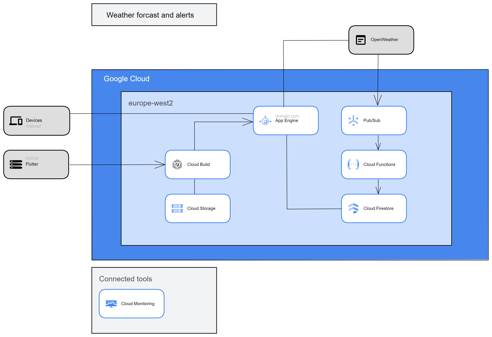

# Weather forcast and alerts

This project contains a Flutter based webpage that can display location based weather data using the openWeather API.
This repo contains neccarssary files to automatic deploy the website to Google Cloud App Engine whenever the local Flutter project is updated commited to the main branch in GitHub, by using Cloud Build.

##Features

- Flutter code for a webpage using openWeather API to  display weather data using webpage visitors location 
- App.yaml file to deploy the app to Appengine
- Docker image to deploy Flutter on Appengine
- Cloudbuild.yaml to automatcly deploy the webpage on appengine when Github main branch is updated.

The current version contains a 404 bug when using cloud build, so temperary the app has to be deployed manually.

For demo see https://andreas-networkingsandboxtest.ew.r.appspot.com/
This repo is the source for the demopage, and updates to this repo will direcly deploy a new version of the webpage. 

##Arcitechture

